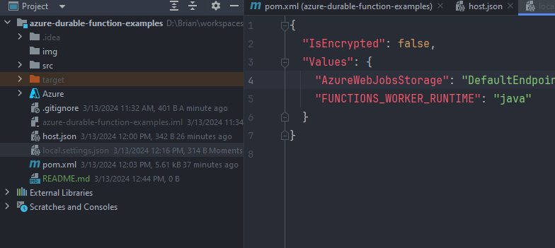
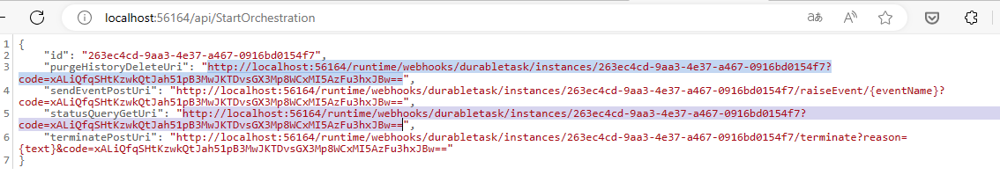

### Durable Function
Pretty much same as Function only difference is, it will run for longer period time than azure's default time out (something like 30min)
and it shows where you can see the result of call.

* see the Function example [here](https://github.com/allthatjava/azure-function-example-in-java)

* Need to add local.settings.json file after download the code

Then need to update the Storage connection string as yours

* After the durable function call, you will get the path where you can see the progress and result
